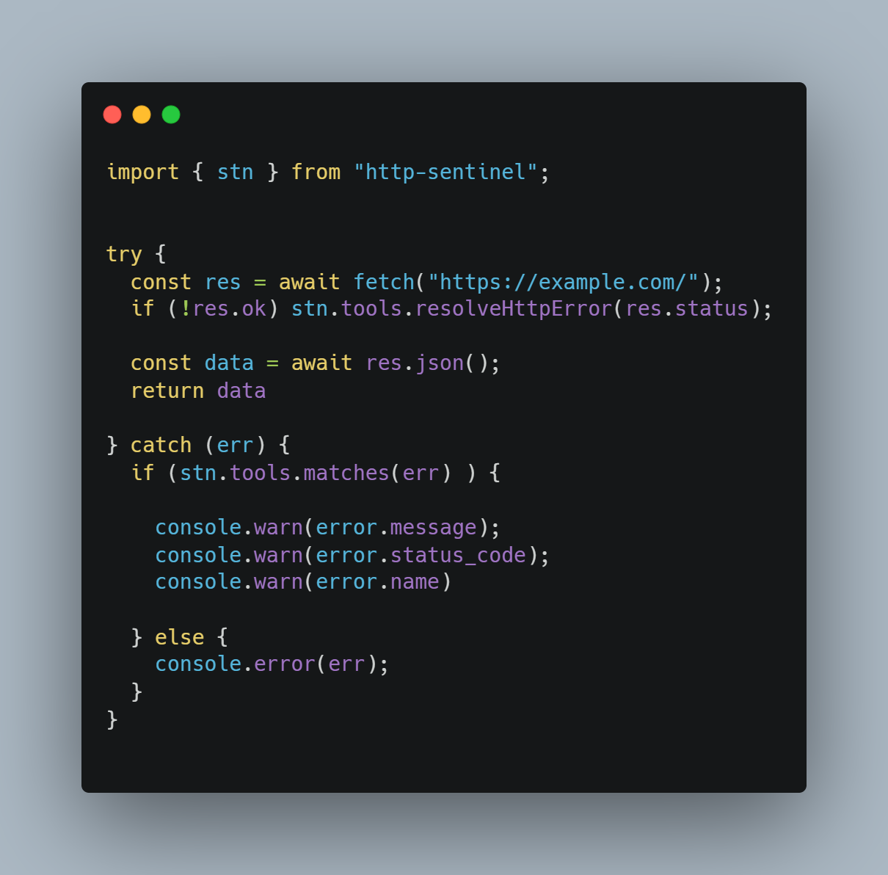

# HTTP Error Handling Library

A TypeScript library that provides a comprehensive set of HTTP error classes and utilities for handling HTTP errors in your applications.



## Table of Contents

* [Features](#features)
* [Installation](#installation)
* [Available Error Classes](#available-error-classes)

  * [4xx Client Errors](#4xx-client-errors)
  * [5xx Server Errors](#5xx-server-errors)
* [API Reference: Core (http-sentinel)](#api-reference-core-http-sentinel)

  * [Purpose](#purpose)
  * [TypeScript Support](#typescript-support)
  * [1. Main Namespace: Core()](#1-main-namespace-core)

    * [1.1. throw (shortcut to throw HTTP errors)](#11-throw-shortcut-to-throw-http-errors)
    * [1.2. collections](#12-collections)
    * [1.3. tools](#13-tools)
    * [1.4. create](#14-create)
  * [2. Common Examples](#2-common-examples)
  * [3. Notes](#3-notes)

---

## Features

* Complete set of HTTP error classes (4xx and 5xx status codes)
* Type-safe error handling
* Custom error messages support
* Utility functions for error type checking
* TypeScript support with full type definitions
* Factory function for creating custom HTTP errors

## Installation

```bash
npm i http-sentinel
```

## Available Error Classes

### 4xx Client Errors

* `BadRequest` (400)
* `Unauthorized` (401)
* `PaymentRequired` (402)
* `Forbidden` (403)
* `NotFound` (404)
* `MethodNotAllowed` (405)
* `NotAcceptable` (406)
* `ProxyAuthenticationRequired` (407)
* `RequestTimeout` (408)
* `Conflict` (409)
* `Gone` (410)
* `LengthRequired` (411)
* `PreconditionFailed` (412)
* `PayloadTooLarge` (413)
* `URITooLong` (414)
* `UnsupportedMediaType` (415)
* `RangeNotSatisfiable` (416)
* `ExpectationFailed` (417)
* `ImATeapot` (418)
* `MisdirectedRequest` (421)
* `UnprocessableEntity` (422)
* `Locked` (423)
* `FailedDependency` (424)
* `TooEarly` (425)
* `UpgradeRequired` (426)
* `PreconditionRequired` (428)
* `TooManyRequests` (429)
* `RequestHeaderFieldsTooLarge` (431)
* `UnavailableForLegalReasons` (451)

### 5xx Server Errors

* `InternalServer` (500)
* `NotImplemented` (501)
* `BadGateway` (502)
* `ServiceUnavailable` (503)
* `GatewayTimeout` (504)
* `HTTPVersionNotSupported` (505)
* `VariantAlsoNegotiates` (506)
* `InsufficientStorage` (507)
* `LoopDetected` (508)
* `NotExtended` (510)
* `NetworkAuthenticationRequired` (511)

---

# API Reference: Core (http-sentinel)

This reference describes the components exposed by `Core()` in English, in tabular format, with usage examples.

## Purpose

Provide a quick guide to develop and handle custom HTTP errors using the object returned by `Core()`.

---

## TypeScript Support

The library provides TypeScript type definitions for improved DX and type safety:

* **`HttpStatusCode`**: a union type of valid HTTP status codes (e.g., `400 | 401 | 404 | 500 | ...`).
* **`HttpErrorMessage`**: can be either a plain string or a predefined set of messages provided by http-sentinel.

  * Predefined messages cover common HTTP error scenarios.
  * Allows any other string as a custom message.
* **`ExpectedError`**: a union type of all standard error class instances provided by http-sentinel.

  * Represents the complete set of recognized error instances.
  * Useful for narrowing `catch` blocks and ensuring type safety when handling known errors.

---

## 1. Main Namespace: stn

Returns an object with four main groups: **throw**, **collections**, **tools**, and **create**.

### 1.1. throw (shortcut to throw HTTP errors)

| Error Name     | Optional Parameter           | What it does                          | Example                                      |
| -------------- | ---------------------------- | ------------------------------------- | -------------------------------------------- |
| `BadRequest`   | `message?: HttpErrorMessage` | Throws a 400 error.                   | `stn.throw.BadRequest('Missing parameters')` |
| ...            | ...                          | ...                                   | ...                                          |
| `UnknownError` | `message?: HttpErrorMessage` | Throws a generic uncategorized error. | `stn.throw.UnknownError()`                   |

---

### 1.2. collections

| Property                                          | Description                  | Example Usage                                            |
| ------------------------------------------------- | ---------------------------- | -------------------------------------------------------- |
| `BadRequest`, `Unauthorized`, ..., `UnknownError` | Specific HTTP error classes. | `if (error instanceof stn.collections.NotFound) { ... }` |

---

### 1.3. tools

| Function           | Parameters                                         | Returns   | Description                                                         | Example                                              |
| ------------------ | -------------------------------------------------- | --------- | ------------------------------------------------------------------- | ---------------------------------------------------- |
| `resolveHttpError` | `statusCode: number`                               | Throws    | Maps an HTTP numeric code to its corresponding error and throws it. | `stn.tools.resolveHttpError(404)`                    |
| `compare`          | `caughtError: unknown`, `target: ErrorConstructor` | `boolean` | Checks if the caught error matches a specific HTTP error class.     | `stn.tools.compare(err, stn.collections.BadRequest)` |
| `matches`          | `err: unknown`                                     | `boolean` | Detects if the error was created by http-sentinel's base structure. | `if (stn.tools.matches(err)) { /* handle */ }`       |

---

### 1.4. create

| Property      | Description                                                                                            | Example                                                                                                           |
| ------------- | ------------------------------------------------------------------------------------------------------ | ----------------------------------------------------------------------------------------------------------------- |
| `customError` | Creates a custom or extended HTTP error based on http-sentinel's foundations. Status code is optional. | `stn.create.customError('MyError', 'customMessage')` or `stn.create.customError('MyError', 'customMessage', 422)` |

---

## 2. Common Examples

### 2.1. Resolve and throw by code

```ts
import { stn } from "http-sentinel"

const status = 403
try {
  stn.tools.resolveHttpError(status);
} catch (e) {
  if (stn.tools.matches(e)) {
    // uniform handling
  }
}
```

### 2.2. Compare caught errors

```ts
import { stn } from "http-sentinel"

try {
  stn.throw.NotFound('User not found');
} catch (err) {
  if (stn.tools.compare(err, stn.collections.NotFound)) {
    console.log('It is an explicit 404');
  }
}
```

### 2.3. Define a custom error

```ts
import { stn } from "http-sentinel"

const MyError = stn.create.customError('MyError', 'Something strange happened');
throw new MyError('Custom thrown');
```

---

## 3. Notes

* Functions in `throw` **always** throw the error; they do not return a value. If you need to handle it without breaking the flow, wrap it in `try/catch`.
* `collections` provides the class references for `instanceof` checks and for passing to `compare`.
* `matches` is useful to filter out errors that are not part of the http-sentinel ecosystem and avoid false positives.
* `customError` allows extension with additional metadata for traceability. The status code argument is optional.
* TypeScript's `HttpStatusCode`, `HttpErrorMessage`, and `ExpectedError` types provide strong typing for status codes, messages, and known error instances.
